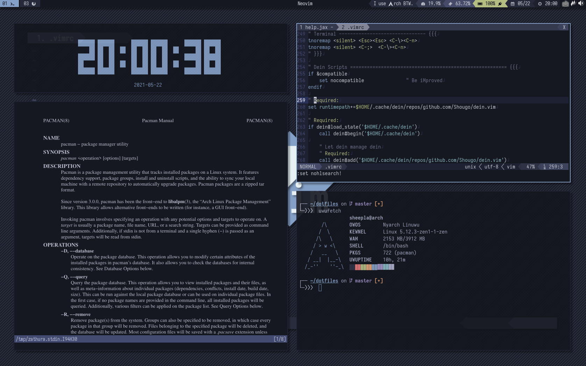

<h1 align="center">🧊 dotfiles</h1>

My rice for Arch Linux

   
   
   

## Apps & Tools

### GUI

- Bar                 : 
  - [bumblebee-status](https://github.com/tobi-wan-kenobi/bumblebee-status)
  - [i3status-rust](https://github.com/greshake/i3status-rust)
- Calculator          : [rofi-calc](https://github.com/svenstaro/rofi-calc)
- Clipboard Manager   : [rofi-greenclip](https://github.com/erebe/greenclip)
- Composite Manager   : [jonaburg/picom](https://github.com/jonaburg/picom) `picom-jonaburg-git`
- Editor              : Vim / Neovim 
- Emoji Selecter      : [rofimoji](https://github.com/fdw/rofimoji)
- Image Viewer        : [sxiv](https://github.com/muennich/sxiv)
- Input Mehod         : fcitx-mozc 
- Launcher            : [rofi]( https://github.com/DaveDavenport/rofi) [MY THEMES!](https://github.com/sheepla/rofi-themes) 
- Nortification Daemon: [dunst](https://dunst-project.org/)
- PDF Viewer          : [zathura](https://pwmt.org/projects/zathura/): `zathura-pdf-mupdf`
- Screenshot Tool     : [flameshot](https://github.com/flameshot-org/flameshot)
- Sound Volue Icon    : [volumeicon](https://softwarebakery.com/maato/volumeicon.html)
- Terminal            : [alacritty](https://github.com/alacritty/alacritty)

### CLI

- Audio Visualizer    : [cava](https://github.com/karlstav/cava)
- Clock               : [tty-clock](http://github.com/xorg62/tty-clock)
- Fetch               : [uwufetch](https://github.com/TheDarkBug/uwufetch)
- Fuzzy Finder        : [fzf](https://github.com/junegunn/fzf)
- Prompt              : [starship](https://starship.rs/)
- Shell               : bash / fish / zsh
- TUI File Manager    : [ranger](https://ranger.github.io)
- `cat` with syntax   : [bat](https://github.com/sharkdp/bat)
- `ls` alternative    : [exa](https://the.exa/website)

## Misc

- GTK Theme           : [Matcha Dark Azul](https://vinceliuice.github.io/theme-matcha) `matcha-gtk-theme`
- Icon Theme          : 
    - [Papirus Dark](https://github.com/PapirusDevelopmentTeam/papirus-icon-theme) `papyrus-icon-theme`
    - [Vimix Icon Theme](https://github.com/vinceliuice/vimix-icon-theme) `vimix-icon-theme`

- Cursor Theme        : [Qogir Cursors](https://www.pling.com/p/1499852) `qogir-cursor-theme-git`
- Monospace Fonts     : 
    - [Sarasa Term J](https://github.com/be5invis/Sarasa-Gothic) 
    - [Cica](https://github.com/miiton/Cica) : `ttf-cica`

- Wallpaper           : [MY WALLPAPERS!](https://github.com/sheepla/wallpapers) 

## Color Theme

Color palette from [cocopon/iceberg.vim](https://github.com/cocopon/iceberg.vim) and [gkeep/iceberg-dark](https://github.com/gkeep/iceberg-dark)

## TODO

- Add more config files
- Add installer script
- Make code more cleaner

